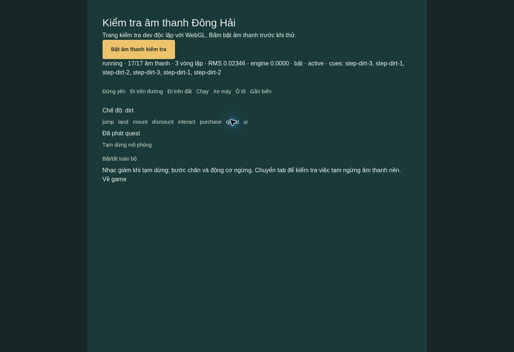

# Đông Hải — Audio v0.5

## Thay đổi

- Nhạc nền ngũ cung gốc dài 48 giây, lặp; không dùng bài hát hoặc bản thu bên ngoài.
- Gió/chim làng và sóng biển; tiếng sóng tăng dần trong bán kính 180 m quanh điểm bờ biển.
- Sáu biến thể bước chân trên đường/đất, nhịp theo quãng đường thực. Không phát khi đứng yên, bị chặn ở tường, ở trên không hoặc đang lái xe.
- Tiếng nhảy, tiếp đất, lên/xuống xe, tương tác, menu, mua hàng và hoàn thành nhiệm vụ.
- Động cơ xe máy/ô tô bằng Web Audio synthesis, cao độ và lọc âm thay đổi theo tốc độ.
- Bốn thanh âm lượng: tổng, nhạc, môi trường, hiệu ứng; bật/tắt và lưu tùy chọn riêng với tiến độ game.
- Âm thanh chỉ mở sau thao tác người dùng. Khi pause: giảm nhạc/ambience, ngừng bước chân và động cơ; khi ẩn tab: suspend audio. Dọn sources/context khi thoát.

## Cấu trúc

`game/audio.ts` quản lý mixer, tải/giải mã, loops, hiệu ứng, cadence và lifecycle. `game/engine.ts` gửi sự kiện gameplay và tốc độ thực. `app/page.tsx` có cài đặt và unlock trong thao tác bắt đầu game.

`public/audio/` chứa 17 tệp, tổng **1.316.847 bytes** (khoảng 1,32 MB): MP3 cho ba lớp nền dài; WAV cho hiệu ứng ngắn. Assets chỉ được fetch sau khi bật âm thanh. Không có thư viện runtime mới.

`public/audio/manifest.json` ghi nguồn tạo, seed, thời lượng, định dạng và SHA-256. `scripts/generate-audio.py` tái tạo bộ âm thanh từ NumPy và FFmpeg; game chỉ cần các file đã tạo sẵn, không cần Python/FFmpeg khi chạy.

## Kiểm tra

- TypeScript: PASS.
- Production build: PASS; vẫn có cảnh báo chunk JS >500 kB từ phần game/3D.
- Automated tests: **32/32 PASS**, gồm 4 test audio mới (settings, bước chân theo khoảng cách, landing một lần, checksum/amplitude/kích thước asset).
- Browser tại trang dev `/audio-check`: AudioContext **running**, giải mã **17/17** tệp, **3 loops**, có tín hiệu đầu ra đo qua AnalyserNode.
- Đã chuyển đi bộ đường/đất, xe máy; thử jump/land/mount/dismount/interact/purchase/quest; không có application error trong log kiểm tra.
- Xe máy ở tốc độ thử: engine gain 0,0264; pause về 0. Mute: RMS về 0,00000; bật lại có tín hiệu. RMS thay đổi theo thời điểm, không phải đánh giá thẩm âm.
- Sau sửa pause, xác minh tương tác và pause với trạng thái running/17 assets/3 loops, engine 0.

Bằng chứng: `docs/qa/v05-tests.txt`, `v05-audio-runtime.json`, `v05-audio-runtime.jpg`.

## Giới hạn

Đã kiểm tra audio runtime riêng trong browser, **chưa nghiệm thu audio đồng bộ với toàn bộ gameplay 3D** do giới hạn WebGL được ghi ở báo cáo trước. Chưa đo độ trễ trên iPhone/Android hoặc kiểm tra đầu ra loa thực của người dùng. Engine/ambience là âm tổng hợp, không phải bản thu phương tiện/làng thật. Trang `/audio-check` chỉ chạy trong dev; production trả 404.

## Chạy

`npm ci` rồi `npm run dev`. Bấm Bắt đầu/Tiếp tục để mở audio. Điều chỉnh ở Cài đặt. Có thể mở `/audio-check` trong dev để thử âm thanh mà không cần WebGL.
