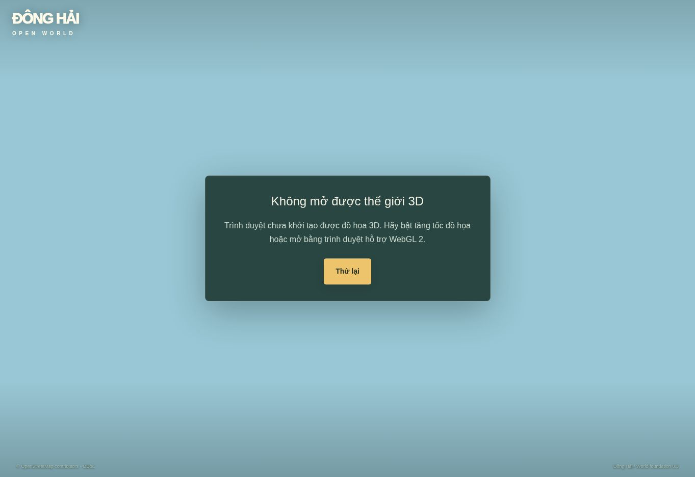

# Đông Hải — World Foundation: checkpoint 0.3.0-phase1

Ngày kiểm tra: 2026-09-10. **Trạng thái: chưa đạt quality gate; sprint chưa DONE.**

## A. Implemented

- Thay dải đường bằng mesh liên tục tại các nút OSM, có mặt đường vồng nhẹ 4,5 cm, lề chuyển xuống nền đất và UV dọc/ngang tuyến. Không thay graph điều hướng OSM.
- Thêm collider trimesh cho cả mặt đường và lề. Test mới phát hiện nhân vật bị chặn tại mép mặt đường khi lề chỉ có hình ảnh; đã sửa bằng collider khớp hình học lề.
- Thêm sân nền đất và dải lối vào nhà cho hệ nhà hiện có. Chưa chứng minh được mật độ hình ảnh tăng 3–5 lần; số nhà vẫn bị giới hạn 105 như v0.2.
- Bề mặt đường có biến thiên tối/sáng và màu đất sát mép qua shader. Đổi định danh GLSL `patch` để tránh tên có khả năng bị dành riêng; chưa xác thực shader trên GPU.
- Thêm 5 góc QA cố định trong bản dev: spawn, đường dân cư, cổng, khu cửa hàng, xe máy. Có xuất PNG trực tiếp từ renderer và JSON camera/draw calls/triangles.
- Chuyển góc reset vị trí, hướng và target vật lý đang chờ, tư thế xe và nhân vật. Đã bổ sung test chuyển góc lặp lại.
- QA đóng băng mô phỏng, chặn thao tác di chuyển/lên xe và không ghi bản lưu. Có nút quay về màn hình chơi.

Các phần kế thừa v0.2 gồm avatar skinned 12 bones/crossfade, smoothing di chuyển, nhà procedural, cây instanced và núi minh họa. Những phần đó chưa đạt yêu cầu asset cuối cùng; không được tính thành cải tiến đã nghiệm thu của checkpoint này.

## B. Architecture

| Module | Vai trò |
|---|---|
| game/roads.ts | Hình học mặt đường/lề và dữ liệu collider |
| game/surfaces.ts | Shader vật liệu dùng chung, biến thiên mặt đường |
| game/engine.ts | Tích hợp road physics, sân/lối vào, QA reset/capture |
| game/visual-qa.ts | Định nghĩa 5 góc và xuất evidence JSON |
| game/avatar.ts | Reset pose cho ảnh có bố cục lặp lại |
| app/page.tsx, app/globals.css | Điều khiển QA chỉ trong dev |
| tests/visual-structure.test.mjs | Road geometry, vượt lề và reset QA |

Stack giữ nguyên Three.js + Rapier + React/Vinext; chưa có hệ Cesium, địa hình đo đạc hoặc streaming dữ liệu đầy đủ. Các nhà/sân/cây/núi minh họa không phải footprint khảo sát.

## C. Test results

| Kiểm tra | Kết quả | Giới hạn |
|---|---|---|
| TypeScript | PASS | Kiểm tra tĩnh |
| Automated tests | 24/24 PASS | Log: qa/v03-phase1-tests.txt |
| Mission/inventory/economy/save | PASS | Luồng dữ liệu, không phải E2E browser |
| Rapier ground/wall + vượt đường/lề | PASS | Mô phỏng CPU thực, chưa quan sát cảm giác điều khiển |
| Geometry/animation/batching/placement | PASS | Không xác minh hình ảnh shader/render |
| Production build | PASS, 5 bước build hoàn tất | Có cảnh báo bundle chunk >500 kB |
| Browser boot | BLOCKED | WebGL context không tạo được |
| Gameplay, 5 screenshot, visual review | CHƯA THỰC HIỆN THÀNH CÔNG | Không có bằng chứng để PASS |

Test vượt đường: capsule đi từ z=-4 đến z≈3,94, không xuyên nền và đạt y≈0,871 trên đỉnh đường. Trước sửa collider lề, capsule mắc ở z≈-2,665. Đây là bằng chứng vật lý; không đại diện cho FPS hoặc hình ảnh.

## D. Performance

FPS gameplay, GPU time, draw calls và triangles runtime: **N/A** vì renderer không khởi tạo. Số 105 nhà trong test chỉ là kích thước fixture. Không dùng số mesh hoặc tốc độ test CPU để suy ra 60 FPS. Cảnh báo bundle >500 kB còn tồn tại.

## E. Visual QA / scorecard

Ảnh người dùng cung cấp là baseline chung: môi trường khoảng 3–4/10 theo mô tả của người dùng. Chưa có bộ baseline cùng 5 camera, không gán điểm đó cho từng góc mới.

| Shot | Nội dung | Before cùng góc | After | Kết luận |
|---|---|---|---|---|
| SHOT-01 | Spawn / đường vào | N/A | N/A | Chưa render |
| SHOT-02 | Đường khu dân cư | N/A | N/A | Chưa render |
| SHOT-03 | Cổng Đông Hải | N/A | N/A | Chưa render |
| SHOT-04 | Khu cửa hàng / ngã rẽ | N/A | N/A | Chưa render |
| SHOT-05 | Xe máy trên đường làng | N/A | N/A | Chưa render |

| Tiêu chí A–O | Điểm mới (0–10) |
|---|---|
| A. Road quality | N/A |
| B. Terrain quality | N/A |
| C. Village density | N/A |
| D. Architecture diversity | N/A |
| E. Material quality | N/A |
| F. Vegetation quality | N/A |
| G. Lighting | N/A |
| H. Atmosphere | N/A |
| I. Character quality | N/A |
| J. Vehicle quality | N/A |
| K. Camera composition | N/A |
| L. World liveliness | N/A |
| M. Background depth | N/A |
| N. Overall realism | N/A |
| O. Performance | N/A |

Không chuyển N/A thành 0 hay PASS. Chưa đủ evidence cho các ngưỡng >=7/10 và character/vehicle >=6/10.

## F. Screenshot / runtime evidence

- `docs/qa/phase1-final-runtime-error.jpg`: ảnh browser thực sau khi chạy bản mới. **Đây là màn hình lỗi, không phải gameplay screenshot.**
- `docs/qa/phase1-final-runtime-errors.json`: lỗi `GL_VENDOR = Disabled`, `GL_RENDERER = Disabled`, `BindToCurrentSequence failed` ghi nhận lúc 04:42 UTC.
- Không có ảnh giả lập, mockup hoặc render offline thay ảnh gameplay.

## G. Remaining issues và điểm dừng

Checkpoint có hai lượt sửa mã liên quan QA/road physics. Lỗi mép đường đã hết trong test; lỗi WebGL vẫn còn ở lần kiểm tra cuối. Dừng trước giới hạn 3 vòng vì đây là blocker môi trường đã tái hiện, không có phương thức browser thay thế được hỗ trợ trong phiên này. Theo mục 28 của yêu cầu người dùng, chưa chuyển sang Phase 2 khi blocker kiểm tra runtime chưa được giải quyết.

Các phần còn thiếu thật sự:

- Chưa đạt mật độ làng 3–5 lần; còn khoảng nền trống lớn và terrain phẳng ở vùng chơi.
- Nhà vẫn procedural lặp, chưa có đủ 15–25 module kiến trúc; bố cục không phải footprint thực.
- Cỏ cone vẫn tồn tại; chưa có hệ vegetation 3 LOD đầy đủ.
- Avatar vẫn dựng từ hình khối, xe máy và NPC vẫn placeholder; chưa đạt hình người/xe cuối cùng.
- Chưa kiểm tra shader compile, độ rõ đường, giao cắt mesh tại ngã rẽ, lighting/exposure bằng render thật.
- Camera, lên/xuống xe, độ mượt và cả nhiệm vụ chưa có E2E browser thành công cho bản này.
- Mốc FPS desktop/mobile và ngân sách draw calls chưa được đo.

## H. Next work (tối đa 5)

1. Chạy bản dev trên môi trường WebGL 2, thu 5 PNG + JSON theo README; kiểm tra cả chơi bình thường.
2. Sửa các lỗi đường/giao cắt/terrain nhìn thấy trong ảnh và kiểm tra va chạm xe.
3. Hoàn thiện density trong vùng dân cư đã xác định; giữ vùng cổng/ao/đồi thoáng theo reference.
4. Sau khi Phase 1 qua gate, làm kiến trúc modular, vật liệu và vegetation.
5. Tiếp tục lighting, humanoid/xe có asset phù hợp, camera và đo hiệu năng theo thứ tự đã chốt.
