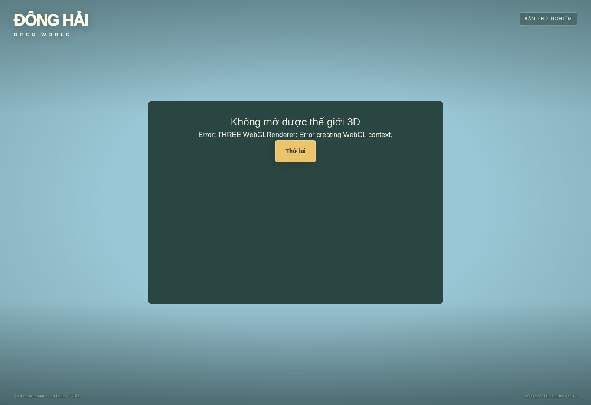
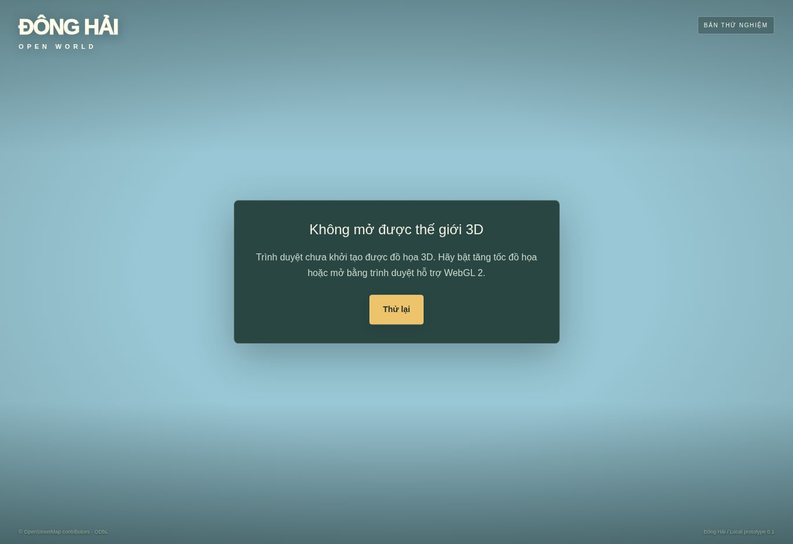

# Đông Hải — báo cáo kiểm tra bản local

**Kết luận: CHƯA ĐẠT nghiệm thu sản phẩm / đồ họa.** Mã nguồn đã qua kiểm tra kỹ thuật bên dưới; trình duyệt kiểm thử bị chặn ở bước tạo WebGL. Không có ảnh cảnh game đã render và không tuyên bố đạt chất lượng GTA.

## Vòng sửa đã thực hiện

1. Kiểm tra ban đầu: TypeScript lỗi tại `container.append(canvas)`; cảnh game không mở vì WebGL context không tạo được. Review code phát hiện mua phụ tùng trước khi nhận nhiệm vụ không được ghi nhận.
2. Sửa: dùng appendChild; ghi nhận phụ tùng có sẵn; chặn mua/giao đồ khi ngoài phạm vi tương tác hoặc đang lái; lọc bản lưu xe không hợp lệ; reset GPS khi chơi mới; đặt nhân vật tại spawn ngay khi khởi tạo; cập nhật cell khi đổi chất lượng. Thông báo lỗi đồ họa được viết lại bằng tiếng Việt, hộp lỗi gọn hơn.
3. Kiểm tra lại: typecheck PASS; build PASS; 12/12 test PASS. Tải lại trình duyệt một lần vẫn báo GL_VENDOR/GL_RENDERER Disabled và BindToCurrentSequence failed. Dừng nhánh visual tại blocker môi trường.

## Bằng chứng

| Gate | Kết quả | Phạm vi thực sự đã kiểm tra |
|---|---|---|
| TypeScript | PASS | `npx tsc --noEmit`, exit 0 |
| Build production | PASS | Sites build / Vinext, đủ 5 bước, exit 0 |
| Logic nhiệm vụ và economy | PASS | Chi phí 200.000; thưởng 250.000 và 150 XP; item bị trừ; không thưởng lặp; mua trước nhiệm vụ |
| Save validation | PASS | JSON round-trip, dữ liệu hỏng, xe không hợp lệ |
| Navigation | PASS | A* có hướng, graph rỗng; dữ liệu đường hiện có nối cổng–shop–biển |
| Physics integration | PASS giới hạn | Rapier thực, capsule trên sàn, không vượt tường sau 600 bước; fixture kiểm thử, chưa phải toàn world |
| Khởi chạy trong browser | BLOCKED | WebGL không tạo được context trong Chrome kiểm thử |
| So sánh cảnh 3D với concept/khảo sát | CHƯA KIỂM CHỨNG | Không có frame 3D hợp lệ để so sánh |
| Nhiệm vụ đầy đủ qua UI, lên/xuống/lái xe | CHƯA KIỂM CHỨNG | Test logic không thay thế E2E thao tác thực |
| Mobile touch, FPS, memory, camera clipping | CHƯA KIỂM CHỨNG | Chưa chạy trên thiết bị iPhone/Android |

12 test chi tiết và thời gian chạy: `qa/core-tests.txt`. Kiểm tra TypeScript: `qa/typecheck.txt`.

Tổng 11 file JS trong dist/client: 3.946.388 byte, tổng gzip tính riêng mỗi file 1.384.901 byte. Đây là số đo artifact build, **không phải** lưu lượng tải đầu hoặc số đo FPS. Build có cảnh báo chunk >500 kB; chưa tối ưu theo profiling.

## Ảnh trình duyệt thực tế

Trước sửa giao diện báo lỗi:

Sau sửa và thử lại:

Hai ảnh này là bằng chứng blocker WebGL, không phải ảnh chứng minh chất lượng world.

## Quy tắc loop và điểm dừng

- Mỗi hạng mục tối đa **3 vòng sửa**, mỗi vòng có lỗi cụ thể → thay đổi → test liên quan → chụp lại nếu thay đổi hình ảnh.
- Dừng sớm khi gate của hạng mục đạt; không chạy lại vô hạn để tìm một lần pass.
- Dừng nhánh ngay khi phụ thuộc môi trường không có sau một lần thử lại, cần nguồn tham khảo chưa có, hoặc 2 vòng liên tiếp không cải thiện.
- Hết 3 vòng còn lỗi: ghi FAIL cùng lỗi và bước tiếp theo. Không đổi tiêu chí để đánh dấu PASS.
- Toàn sprint chỉ DONE khi cả kỹ thuật, E2E, visual và performance đều đạt. Hiện **chưa DONE**.

## Phần còn thiếu so với plan

World hiện dùng mesh thủ tục thử nghiệm, cây/nhà/địa hình minh họa; chưa có bộ hero GLB đã nghiệm thu, chưa xác nhận hình học cổng/đường biên bờ biển với nguồn đủ độ chính xác. Cell hiện chỉ bật/tắt hiển thị và collider, chưa phải streaming tải/unload tài nguyên thực. Backend/PostGIS, Cesium và traffic chưa được nghiệm thu. Không mở rộng world trước khi kiểm tra cell hiện tại.

Bước nối tiếp: trên môi trường WebGL 2 hoạt động, mở bản local; chụp start, góc chính diện cổng, nhìn ngược, camera orbit, đi bộ, lái xe, cửa hàng và bờ biển; hoàn thành nhiệm vụ bằng UI; reload xác minh tiến độ; đo FPS/frame-time trên desktop và mobile. Chỉ sau đó tiếp tục sửa art bằng ảnh đối chiếu.
